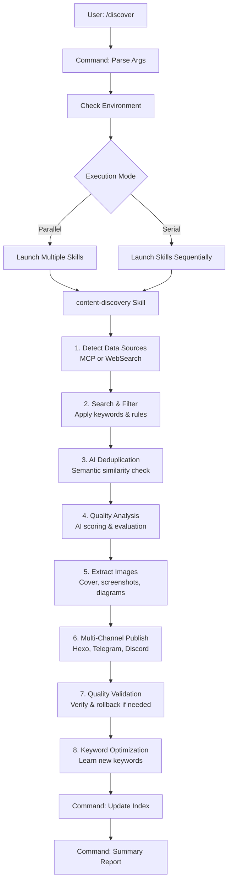

# Content Discovery Plugin for Claude Code

> AI-powered content discovery and publishing automation. Automatically discover, analyze, and publish high-quality content from ArXiv papers, GitHub repositories, and HuggingFace models to your blog, Telegram, or Discord.

[](https://docs.claude.com/en/docs/claude-code)
[](../LICENSE)
[](./CHANGELOG.md)

[English](./README.md) | [中文文档](./README_zh-CN.md)

## ✨ Features

- 🔍 **Multi-Source Discovery**: ArXiv papers, GitHub repositories, HuggingFace models
- 🤖 **AI-Powered Filtering**: Semantic deduplication and quality analysis
- 🎯 **Smart Keywords**: Auto-learning keyword system with confidence scoring
- 📝 **Quality Summaries**: High-quality content generation (Chinese/English)
- 🖼️ **Image Extraction**: Automatic cover, screenshot, and diagram downloads
- 📤 **Multi-Channel Publishing**: Hexo blog, Telegram, Discord
- ✅ **Quality Validation**: Post-publication verification with rollback
- 🔄 **Parallel Execution**: Fast processing with concurrent task execution
- 📊 **Task Management**: Full lifecycle management with status tracking

## 🚀 Quick Start

### Installation

```bash
# Install from marketplace (when available)
/plugin install content-discovery

# Or install from GitHub
/plugin install https://github.com/longkeyy/claude-discover

# Or install locally for development
/plugin install /path/to/claude-discover/.claude-plugin
```

### Basic Usage

```bash
# 1. Create a task
/mission add

# 2. Run discovery
/discover

# 3. View results
/mission show
```

### Complete Example

```bash
# Create a task for tracking AI papers
/mission add
# Follow the interactive wizard:
# - Task ID: ai-papers
# - Type: paper
# - Source: ArXiv
# - Keywords: "large language model", "transformer"

# Execute discovery (parallel mode, default)
/discover ai-papers

# Expected output:
# ✅ Found 50 papers
# ✅ Filtered 15 duplicates
# ✅ Published 20 high-quality papers
# 💡 Discovered 5 new keywords
```

## 📖 Documentation

### Commands

#### `/mission` - Task Management

| Command | Description |
|---------|-------------|
| `/mission` or `/mission show` | List all tasks with status |
| `/mission add` | Create new task (interactive) |
| `/mission update <task-id>` | Update task configuration |
| `/mission enable <task-id>` | Enable a task |
| `/mission disable <task-id>` | Disable a task |
| `/mission delete <task-id>` | Delete task (archives to `.archived/`) |

#### `/discover` - Content Discovery

| Command | Description |
|---------|-------------|
| `/discover` or `/discover all` | Run all enabled tasks (parallel) |
| `/discover <task-id>` | Run specific task |
| `/discover task1 task2 task3` | Run multiple tasks (parallel) |
| `/discover --serial <task-id>` | Run in serial mode (debugging) |
| `/discover --parallel all` | Explicit parallel mode |

### Execution Modes

| Mode | Speed | Best For | Notes |
|------|-------|----------|-------|
| **Parallel** | ⚡ 3-4x faster | Daily use, multiple tasks | Default mode |
| **Serial** | 🐌 Slower | Debugging, detailed logs | Use `--serial` flag |

### Configuration Structure

```
config/
├── tasks.index.yaml          # Auto-maintained index
├── tasks/
│   ├── .template.md          # Task template
│   ├── ai-papers.md          # Your task configs
│   └── ml-tools.md
├── keywords/
│   ├── .templates/
│   │   └── default.json      # Keyword template
│   ├── ai-papers.json        # Keyword configs
│   └── ml-tools.json
└── .archived/                # Deleted tasks/keywords
    └── 2025-01-15/
```

### Task Configuration

See complete examples:
- [ArXiv Papers Example](./examples/task-arxiv-example.md)
- [GitHub Projects Example](./examples/task-github-example.md)
- [Keywords Example](./examples/keywords-example.json)

**Basic structure**:

```yaml
---
name: "Task Display Name"
task_id: "task-slug"
description: "What this task discovers"
enabled: true
---

# Task Configuration

## Data Sources
### ArXiv / GitHub / HuggingFace
- Tool preferences
- Fallback options

## Filtering Rules
```yaml
filters:
  time_range: "last_7_days"
  minimum_quality_score: 75
  categories: [cs.AI, cs.LG]
```

## Publishing
### Hexo Blog
```yaml
hexo:
  enabled: true
  post_dir: "source/_posts/papers"
  template: ...
```

### Telegram Channel
```yaml
telegram:
  enabled: true
  channel_id: "@your_channel"
```
```

### Environment Variables

Create `.env` in your project root (see [`.env.example`](./examples/.env.example)):

```bash
# Optional: Hexo blog publishing
HEXO_PATH=/path/to/your/hexo-blog

# Optional: Telegram publishing
TELEGRAM_BOT_TOKEN=123:ABCdef...
TELEGRAM_CHANNEL_ID=@your_channel

# Optional: Discord publishing
DISCORD_WEBHOOK_URL=https://discord.com/api/webhooks/...
```

### MCP Servers (Recommended)

Install these MCP servers for better performance:

```bash
# HuggingFace (highly recommended)
/mcp install hf-mcp-server

# ArXiv (optional, falls back to WebSearch)
/mcp install arxiv

# GitHub (optional, falls back to WebSearch)
/mcp install github
```

**Note**: Plugin automatically falls back to `WebSearch` if MCP servers are unavailable.

## 🏗️ Architecture

This plugin follows Claude Code best practices with **Command + Skill** pattern:

```
.claude-plugin/
├── commands/              # User-triggered entry points
│   ├── discover.md       # /discover command
│   └── mission.md        # /mission command
├── skills/               # AI-invoked capabilities
│   └── content-discovery/ # Core discovery workflow
│       └── skill.md      # Skill definition
├── hooks/                # Automation hooks
│   ├── hooks.json        # Hook configuration
│   └── scripts/
│       └── session_start.sh
├── examples/             # Configuration templates
│   ├── task-arxiv-example.md
│   ├── task-github-example.md
│   ├── keywords-example.json
│   └── .env.example
├── scripts/              # Build & deployment
│   ├── hooks/
│   └── ...
└── plugin.json           # Plugin manifest
```

**Key design principles**:
- ✅ **Commands** orchestrate workflows and handle user input
- ✅ **Skills** encapsulate business logic (discoverable by AI)
- ✅ **Hooks** automate routine tasks (session start, post-write validation)
- ✅ **Scripts** provide utility functions (reusable across commands/skills)

See [Architecture Documentation](../ARCHITECTURE.md) for detailed design rationale.

## 📊 Workflow



## 📁 Output Structure

```
project-root/
├── config/               # Task & keyword configs
│   ├── tasks/
│   ├── keywords/
│   └── .archived/
├── posts/                # Published content (JSON)
│   └── {task-id}/
│       └── 2025-01-15_topic_title.json
├── images/               # Downloaded images
│   └── {task-id}/
│       └── {slug}/
│           ├── cover.png
│           ├── diagram-1.svg
│           └── screenshot-1.png
└── temp/                 # Temporary session data
    └── sessions/
        └── {task-id}/
            └── {session-id}/
                └── session.log
```

## 🔧 Advanced Features

### Hooks

The plugin includes automation hooks (see [`hooks/hooks.json`](./hooks/hooks.json)):

- **SessionStart**: Display project status when starting Claude Code
- **PostToolUse** (Write): Validate JSON files after writing

### Parallel vs Serial Execution

**Parallel Mode** (default):
```bash
/discover task1 task2 task3
# ⚡ 3 tasks run simultaneously
# ✅ Fastest performance
# ⚠️ Harder to debug individual tasks
```

**Serial Mode**:
```bash
/discover --serial task1 task2 task3
# 📝 Tasks run one by one
# ✅ Detailed logging for each task
# ✅ Easier debugging
# ⚠️ Slower overall execution
```

### Quality Standards

Content must meet these criteria before publication:

**All Tasks**:
- Minimum content length (configurable, default: 1000 chars)
- Required metadata fields present
- Valid JSON structure

**Paper Tasks**:
- Must have `arxiv_url`
- Release date ≠ collection date
- Technical report link (if available)

**GitHub Tasks**:
- Tools/resources documented (for MCP servers)
- README summary extracted
- Configuration examples provided

### Image Management

The plugin automatically:
1. **Discovers** images from README, documentation, or official sites
2. **Classifies** as cover (1), screenshots (max 3), or diagrams (max 3)
3. **Downloads** to `images/{task-id}/{slug}/`
4. **Validates** size (<5MB) and format (PNG, JPG, SVG, WebP)
5. **Updates** JSON with local paths and metadata

Failed downloads are logged but don't block publication.

## 🧪 Development

### Testing

```bash
# Validate plugin structure
make test

# Test specific task in serial mode
/discover --serial test-task

# Check session logs
cat temp/sessions/{task-id}/{session-id}/session.log
```

### Building

```bash
# Build plugin package
make build

# Install locally for testing
make install
```

### Versioning

```bash
# Semantic versioning
make version-patch   # 1.0.0 -> 1.0.1
make version-minor   # 1.0.0 -> 1.1.0
make version-major   # 1.0.0 -> 2.0.0
```

### Publishing

```bash
# Publish to GitHub (creates release)
make publish

# Manual process:
# 1. Update version in plugin.json
# 2. Update CHANGELOG.md
# 3. Create git tag
# 4. Push tag to trigger GitHub Actions
```

## 🔍 Troubleshooting

### No Content Discovered

**Checklist**:
1. ✅ Task is enabled: `/mission show`
2. ✅ Keywords configured: `cat config/keywords/{task-id}.json`
3. ✅ Data sources accessible: Check MCP servers or network
4. ✅ Filters not too strict: Review `config/tasks/{task-id}.md`

**Debug**:
```bash
# Run in serial mode for detailed logs
/discover --serial {task-id}

# Check what was filtered out
cat temp/sessions/{task-id}/{session-id}/session.log
```

### Images Not Downloading

**Checklist**:
1. ✅ `curl` installed: `which curl`
2. ✅ URLs accessible: Test manually
3. ✅ Disk space available: `df -h`
4. ✅ File size under limit (default: 5MB)

**Debug**:
```bash
# Test image download manually
curl -I https://example.com/image.png

# Check download logs
grep "download" temp/sessions/{task-id}/{session-id}/session.log
```

### Publishing Failed

**Hexo**:
```bash
# Verify path
echo $HEXO_PATH
ls $HEXO_PATH/source/_posts

# Check permissions
ls -la $HEXO_PATH/source/_posts
```

**Telegram**:
```bash
# Test bot token
curl -X POST "https://api.telegram.org/bot${TELEGRAM_BOT_TOKEN}/getMe"

# Test channel access
curl -X POST "https://api.telegram.org/bot${TELEGRAM_BOT_TOKEN}/getChat?chat_id=${TELEGRAM_CHANNEL_ID}"
```

**Discord**:
```bash
# Test webhook
curl -X POST "${DISCORD_WEBHOOK_URL}" \
  -H "Content-Type: application/json" \
  -d '{"content": "Test message"}'
```

### Serial Mode for Debugging

When issues occur, always try serial mode first:

```bash
/discover --serial {problematic-task-id}
```

This provides:
- Detailed step-by-step logging
- Clearer error messages
- Easier identification of failure points

## 📚 Additional Resources

### Documentation
- [Architecture Design](../ARCHITECTURE.md)
- [Publishing Guide](./PUBLISHING.md)
- [Changelog](./CHANGELOG.md)
- [Chinese Documentation](./README_zh-CN.md)

### Examples
- [ArXiv Task Configuration](./examples/task-arxiv-example.md)
- [GitHub Task Configuration](./examples/task-github-example.md)
- [Keywords Configuration](./examples/keywords-example.json)
- [Environment Variables](./examples/.env.example)

### External Links
- [Claude Code Documentation](https://docs.claude.com/en/docs/claude-code)
- [Claude Code Best Practices](https://www.anthropic.com/engineering/claude-code-best-practices)
- [MCP Protocol](https://modelcontextprotocol.io/)
- [Hexo Documentation](https://hexo.io/docs/)

## 🤝 Contributing

Contributions are welcome! Please:

1. Fork the repository
2. Create a feature branch (`git checkout -b feature/amazing-feature`)
3. Commit your changes (`git commit -m 'Add amazing feature'`)
4. Push to the branch (`git push origin feature/amazing-feature`)
5. Open a Pull Request

## 📄 License

MIT License - see [LICENSE](../LICENSE) for details.

## 🙏 Acknowledgments

- Built with [Claude Code](https://docs.claude.com/en/docs/claude-code)
- Follows [Claude Code Best Practices](https://www.anthropic.com/engineering/claude-code-best-practices)
- Powered by [Model Context Protocol (MCP)](https://modelcontextprotocol.io/)
- Thanks to the Claude Code community

## 🔗 Links

- **Repository**: https://github.com/longkeyy/claude-discover
- **Issues**: https://github.com/longkeyy/claude-discover/issues
- **Discussions**: https://github.com/longkeyy/claude-discover/discussions
- **Changelog**: [CHANGELOG.md](./CHANGELOG.md)

---

**Get Started**: Run `/mission add` to create your first discovery task! 🚀

Made with ❤️ by [longkeyy](https://github.com/longkeyy)
